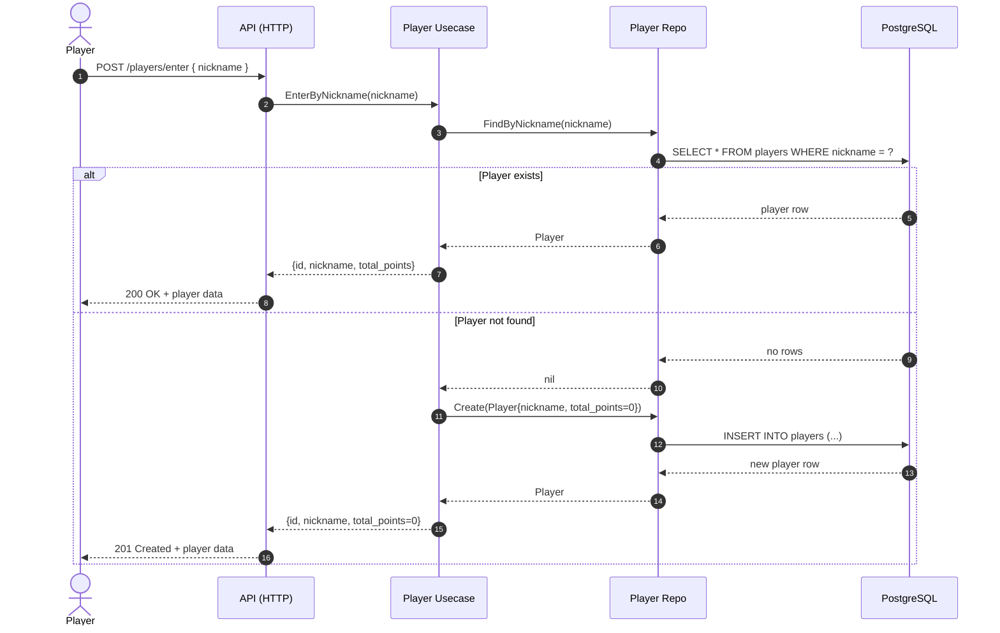

# Enter/Resume: POST /players/enter

```mermaid
sequenceDiagram
    autonumber
    actor Player
    participant API as API (HTTP)
    participant PlayerUC as Player Usecase
    participant PlayerRepo as Player Repo
    participant DB as PostgreSQL

    Player->>API: POST /players/enter { nickname }
    API->>PlayerUC: EnterByNickname(nickname)
    PlayerUC->>PlayerRepo: FindByNickname(nickname)
    PlayerRepo->>DB: SELECT * FROM players WHERE nickname = ?
    
    alt Player exists
        DB-->>PlayerRepo: player row
        PlayerRepo-->>PlayerUC: Player
        PlayerUC-->>API: {id, nickname, total_points}
        API-->>Player: 200 OK + player data
    else Player not found
        DB-->>PlayerRepo: no rows
        PlayerRepo-->>PlayerUC: nil
        PlayerUC->>PlayerRepo: Create(Player{nickname, total_points=0})
        PlayerRepo->>DB: INSERT INTO players (...)
        DB-->>PlayerRepo: new player row
        PlayerRepo-->>PlayerUC: Player
        PlayerUC-->>API: {id, nickname, total_points=0}
        API-->>Player: 201 Created + player data
    end
```