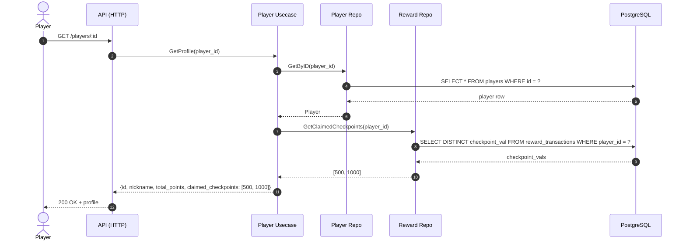

# Get Player Profile: GET /players/:id

```mermaid
sequenceDiagram
    autonumber
    actor Player
    participant API as API (HTTP)
    participant PlayerUC as Player Usecase
    participant PlayerRepo as Player Repo
    participant RewardRepo as Reward Repo
    participant DB as PostgreSQL

    Player->>API: GET /players/:id
    API->>PlayerUC: GetProfile(player_id)
    PlayerUC->>PlayerRepo: GetByID(player_id)
    PlayerRepo->>DB: SELECT * FROM players WHERE id = ?
    DB-->>PlayerRepo: player row
    PlayerRepo-->>PlayerUC: Player

    PlayerUC->>RewardRepo: GetClaimedCheckpoints(player_id)
    RewardRepo->>DB: SELECT DISTINCT checkpoint_val FROM reward_transactions WHERE player_id = ?
    DB-->>RewardRepo: checkpoint_vals
    RewardRepo-->>PlayerUC: [500, 1000]

    PlayerUC-->>API: {id, nickname, total_points, claimed_checkpoints: [500, 1000]}
    API-->>Player: 200 OK + profile
```