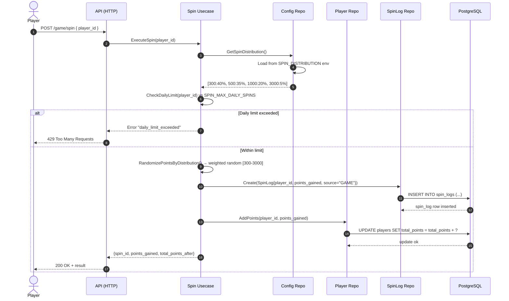

# Spin Game: POST /game/spin

```mermaid
sequenceDiagram
    autonumber
    actor Player
    participant API as API (HTTP)
    participant SpinUC as Spin Usecase
    participant ConfigRepo as Config Repo
    participant PlayerRepo as Player Repo
    participant SpinLogRepo as SpinLog Repo
    participant DB as PostgreSQL

    Player->>API: POST /game/spin { player_id }
    API->>SpinUC: ExecuteSpin(player_id)
    
    SpinUC->>ConfigRepo: GetSpinDistribution()
    ConfigRepo->>ConfigRepo: Load from SPIN_DISTRIBUTION env
    ConfigRepo-->>SpinUC: [300:40%, 500:35%, 1000:20%, 3000:5%]

    SpinUC->>SpinUC: CheckDailyLimit(player_id) vs SPIN_MAX_DAILY_SPINS
    alt Daily limit exceeded
        SpinUC-->>API: Error "daily_limit_exceeded"
        API-->>Player: 429 Too Many Requests
    else Within limit
        SpinUC->>SpinUC: RandomizePointsByDistribution() → weighted random [300-3000]
        SpinUC->>SpinLogRepo: Create(SpinLog{player_id, points_gained, source="GAME"})
        SpinLogRepo->>DB: INSERT INTO spin_logs (...)
        DB-->>SpinLogRepo: spin_log row inserted

        SpinUC->>PlayerRepo: AddPoints(player_id, points_gained)
        PlayerRepo->>DB: UPDATE players SET total_points = total_points + ?
        DB-->>PlayerRepo: update ok

        SpinUC-->>API: {spin_id, points_gained, total_points_after}
        API-->>Player: 200 OK + result
    end
```