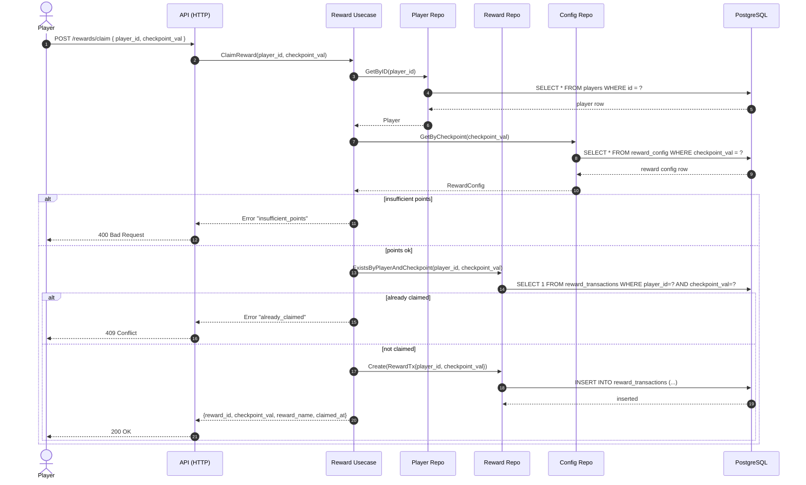

# Claim Reward: POST /rewards/claim

```mermaid
sequenceDiagram
    autonumber
    actor Player
    participant API as API (HTTP)
    participant RewardUC as Reward Usecase
    participant PlayerRepo as Player Repo
    participant RewardRepo as Reward Repo
    participant ConfigRepo as Config Repo
    participant DB as PostgreSQL

    Player->>API: POST /rewards/claim { player_id, checkpoint_val }
    API->>RewardUC: ClaimReward(player_id, checkpoint_val)

    RewardUC->>PlayerRepo: GetByID(player_id)
    PlayerRepo->>DB: SELECT * FROM players WHERE id = ?
    DB-->>PlayerRepo: player row
    PlayerRepo-->>RewardUC: Player

    RewardUC->>ConfigRepo: GetByCheckpoint(checkpoint_val)
    ConfigRepo->>DB: SELECT * FROM reward_config WHERE checkpoint_val = ?
    DB-->>ConfigRepo: reward config row
    ConfigRepo-->>RewardUC: RewardConfig

    alt insufficient points
        RewardUC-->>API: Error "insufficient_points"
        API-->>Player: 400 Bad Request
    else points ok
        RewardUC->>RewardRepo: ExistsByPlayerAndCheckpoint(player_id, checkpoint_val)
        RewardRepo->>DB: SELECT 1 FROM reward_transactions WHERE player_id=? AND checkpoint_val=?
        alt already claimed
            RewardUC-->>API: Error "already_claimed"
            API-->>Player: 409 Conflict
        else not claimed
            RewardUC->>RewardRepo: Create(RewardTx{player_id, checkpoint_val})
            RewardRepo->>DB: INSERT INTO reward_transactions (...)
            DB-->>RewardRepo: inserted
            RewardUC-->>API: {reward_id, checkpoint_val, reward_name, claimed_at}
            API-->>Player: 200 OK
        end
    end
```