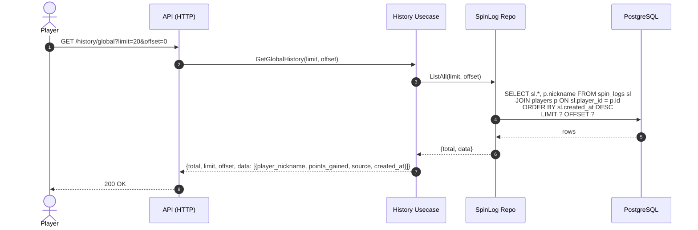

# Global Spin History: GET /history/global

```mermaid
sequenceDiagram
    autonumber
    actor Player
    participant API as API (HTTP)
    participant HistoryUC as History Usecase
    participant SpinLogRepo as SpinLog Repo
    participant DB as PostgreSQL

    Player->>API: GET /history/global?limit=20&offset=0
    API->>HistoryUC: GetGlobalHistory(limit, offset)
    HistoryUC->>SpinLogRepo: ListAll(limit, offset)
    SpinLogRepo->>DB: SELECT sl.*, p.nickname FROM spin_logs sl<br/>JOIN players p ON sl.player_id = p.id<br/>ORDER BY sl.created_at DESC<br/>LIMIT ? OFFSET ?
    DB-->>SpinLogRepo: rows
    SpinLogRepo-->>HistoryUC: {total, data}
    HistoryUC-->>API: {total, limit, offset, data: [{player_nickname, points_gained, source, created_at}]}
    API-->>Player: 200 OK
```