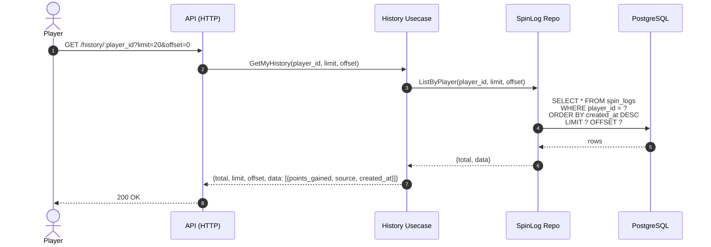

# Personal Spin History: GET /history/:player_id

```mermaid
sequenceDiagram
    autonumber
    actor Player
    participant API as API (HTTP)
    participant HistoryUC as History Usecase
    participant SpinLogRepo as SpinLog Repo
    participant DB as PostgreSQL

    Player->>API: GET /history/:player_id?limit=20&offset=0
    API->>HistoryUC: GetMyHistory(player_id, limit, offset)
    HistoryUC->>SpinLogRepo: ListByPlayer(player_id, limit, offset)
    SpinLogRepo->>DB: SELECT * FROM spin_logs<br/>WHERE player_id = ?<br/>ORDER BY created_at DESC<br/>LIMIT ? OFFSET ?
    DB-->>SpinLogRepo: rows
    SpinLogRepo-->>HistoryUC: {total, data}
    HistoryUC-->>API: {total, limit, offset, data: [{points_gained, source, created_at}]}
    API-->>Player: 200 OK
```