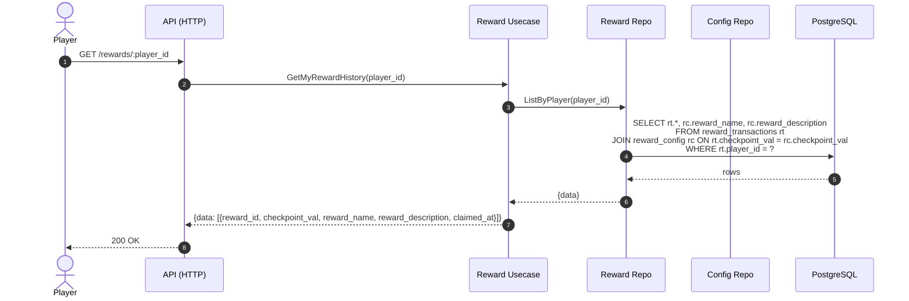

# Reward Claim History: GET /rewards/:player_id

```mermaid
sequenceDiagram
    autonumber
    actor Player
    participant API as API (HTTP)
    participant RewardUC as Reward Usecase
    participant RewardRepo as Reward Repo
    participant ConfigRepo as Config Repo
    participant DB as PostgreSQL

    Player->>API: GET /rewards/:player_id
    API->>RewardUC: GetMyRewardHistory(player_id)
    
    RewardUC->>RewardRepo: ListByPlayer(player_id)
    RewardRepo->>DB: SELECT rt.*, rc.reward_name, rc.reward_description<br/>FROM reward_transactions rt<br/>JOIN reward_config rc ON rt.checkpoint_val = rc.checkpoint_val<br/>WHERE rt.player_id = ?
    DB-->>RewardRepo: rows
    RewardRepo-->>RewardUC: {data}
    
    RewardUC-->>API: {data: [{reward_id, checkpoint_val, reward_name, reward_description, claimed_at}]}
    API-->>Player: 200 OK
```